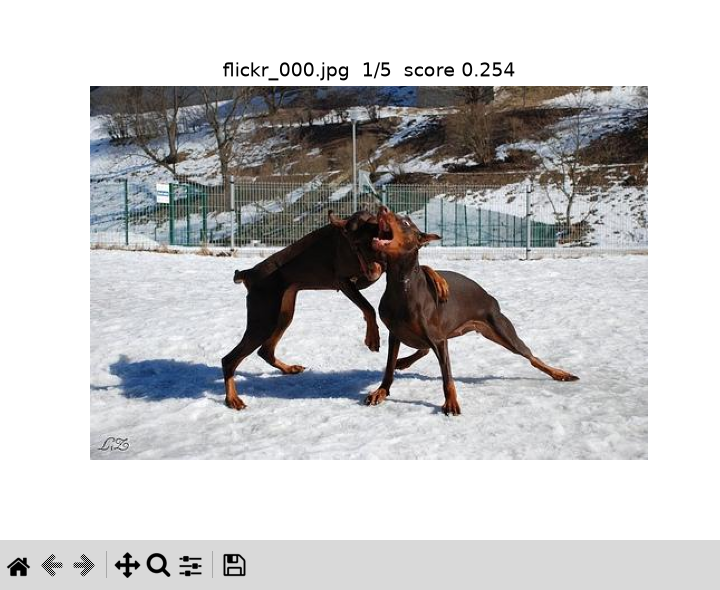

# Setup and running

smartGallerySearcher finds the photo in a folder that best matches a text prompt.
It embeds every image and the prompt with [CLIP](https://huggingface.co/openai/clip-vit-large-patch14)
into the same vector space and ranks the images by cosine similarity, so no labels,
captions or training are needed.

## Demo gallery

`img/` ships with 50 photos from the [Flickr8k](https://huggingface.co/datasets/jxie/flickr8k)
test split, and `img/captions.txt` lists one human caption per photo so results can be checked.

## With Docker (recommended)

```bash
docker build -t smartgallery .

docker run --rm --gpus all \
  -v ~/.cache/huggingface:/root/.cache/huggingface \
  smartgallery "dogs playing in the snow" --top-k 3
```

- `-v ~/.cache/huggingface:...` keeps the CLIP weights (~1.7 GB) between runs, so they
  are only downloaded the first time. Add `-e HF_HUB_OFFLINE=1` to forbid any download.
- To search your own photos, add `-v /path/to/photos:/app/img`.
- Drop `--gpus all` to run on CPU, it is slower but works the same.

Some prompts to try, none of them copied from the captions:

| Prompt                         | Best match       | Caption                                                     |
|--------------------------------|------------------|-------------------------------------------------------------|
| dogs playing in the snow       | `flickr_000.jpg` | The dogs are in the snow in front of a fence                |
| a car splashing through mud    | `flickr_024.jpg` | A black Mitsubishi is driving through a muddy puddle        |
| someone skateboarding          | `flickr_023.jpg` | A man wearing a red helmet jumps up while riding a skateboard |
| a parachute landing in water   | `flickr_033.jpg` | a man crashes into the water with his parachute             |

## Without Docker

Python 3.10+:

```bash
python -m venv .venv && source .venv/bin/activate
pip install -r requirements.txt
python agent.py "blue shirt boy walking in the port" --gallery img --top-k 3
```

## Input and output

### Input

- **Prompt**: the text describing the image, first argument.
- **Gallery**: a folder of images. Supported formats: jpg, jpeg, png, bmp, gif, webp, other files are ignored.
- **Settings**: the model, gallery, top-k and device are read from [settings.json](settings.json).

`device` is `auto` (GPU if available), `cuda` or `cpu`. To change settings without editing this file,
pass your own file with `--config`, it only needs the keys it changes:

```bash
echo '{"top_k": 5, "device": "cpu"}' > my_settings.json
python agent.py "dogs playing in the snow" --config my_settings.json
```

With Docker, mount it into the container: `-v $PWD/my_settings.json:/app/my_settings.json ... --config my_settings.json`.

Priority, lowest to highest: `settings.json`, `--config` file, command line arguments.

| Argument    | Default                               | Description                          |
|-------------|---------------------------------------|--------------------------------------|
| `prompt`    | `blue shirt boy walking in the port`  | Text describing the image            |
| `--gallery` | from settings                         | Folder of images to search           |
| `--top-k`   | from settings                         | Number of results                    |
| `--config`  |                                       | JSON file overriding `settings.json` |
| `--json`    | off                                   | Print the results as JSON            |
| `--show`    | off                                   | Open the results in a window         |

### Output

Results are printed to stdout, best match first. By default one line per match, score then path:

```
0.254  img/flickr_000.jpg
0.166  img/flickr_008.jpg
```

With `--json`:

```json
{
  "prompt": "dogs playing in the snow",
  "results": [
    {"path": "img/flickr_000.jpg", "score": 0.2541517913341522},
    {"path": "img/flickr_008.jpg", "score": 0.16629520058631897}
  ]
}
```

The score is the cosine similarity between the prompt and the image, higher is closer.
Logs and progress bars go to stderr, so the output can be piped directly, for example:

```bash
python agent.py "dogs playing in the snow" --top-k 3 --json | jq -r '.results[].path'
```

### Browse the results in a window

With `--show`, the results also open in one window, best match first:

```bash
python agent.py "dogs playing in the snow" --top-k 5 --show
```



Use the left and right arrows to browse the results and `q` to close. The toolbar at the bottom can zoom
into the image or save it.

This needs a display and Tk for matplotlib, on Ubuntu `sudo apt install python3-tk`. Run it from a normal
terminal so sudo can ask for the password. It does not work inside the Docker container, since it has no display.

## Tests

```bash
pip install -r requirements-dev.txt
pytest
```

The tests use a fake model, so they run in seconds and don't download CLIP.
